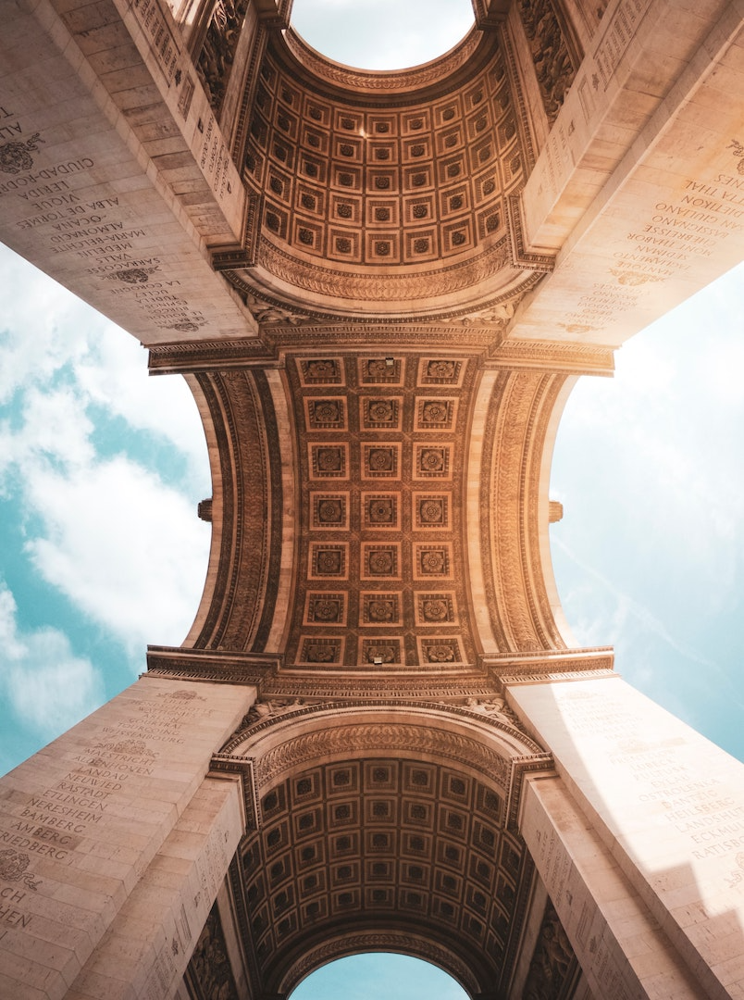

# Non-Photorealistic Renderer
Processes images and converts them into de-tailed multi-layered paintings
with the ability to interpolate and incorporate de-sign styles from a
reference image. See [write-up](https://drive.google.com/file/d/1x5Y84A4EAHg7Zd1aBR3Q-ojyGOiilACJ/view) for details of the algorithm
and some examples of the main code below. There are more features and how to use them documented in the write-up.

<table>
<tr>
<td> </td>

<td></td>
</tr>
<tr>
<td> </td>

<td></td>
</tr>
<tr>
<td> </td>

<td></td>
</tr>
<tr>
<td> </td>

<td></td>
</tr>
<tr>
<td> </td>

<td></td>
</tr>
</table>

NOTE: I do not own any of the images not in Input/photos directory.

To run this code on your own images, follow the test code in [a9_main.cpp](a9_main.cpp) and put in your own images. Run `make` and then `./a9`.
